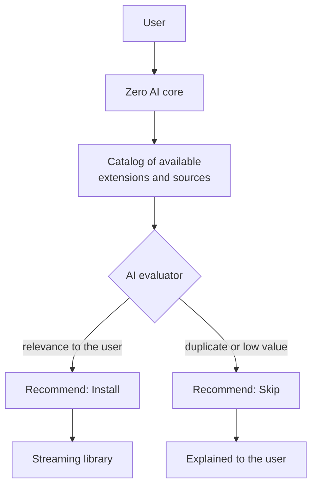
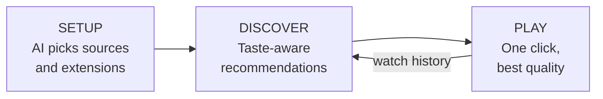

<p align="center">
  
</p>

<div align="center">

**An AI companion for streaming: it finds, installs and plays, so you just watch.**


</div>

<br/>

Zero AI is a streaming platform in the spirit of extension-driven apps like CloudStream, without the manual setup. Instead of asking users to decide what to download and install, Zero AI recommends what is worth getting and what to skip, and its built-in AI companion handles the rest.

---

## 🖼️ Product Tour

<p align="center">
  
</p>
<p align="center">
  
  
</p>
<p align="center"><sub>Interface designs: home, player and extension management.</sub></p>

---

## 💡 The Problem and the Idea

Extension-driven streaming apps are powerful, but they hand the setup work to the user: find the right repositories, pick from dozens of extensions, work out which ones overlap, which are maintained and which are likely to break. Most people give up, or end up with a cluttered, unreliable setup.

Zero AI moves that decision-making to an AI:

- 🧠 **It decides for you:** the AI recommends what to install and what to skip
- 🔎 **It explains why:** every suggestion comes with a reason
- ⚡ **It removes steps:** setup, sources and playback handled in one flow
- 🎯 **It learns your taste:** recommendations follow what you actually watch

---

## ✨ Features

| | Feature | What it does |
|---|---|---|
| 🤖 | **AI Setup** | Finds and installs the best sources, extensions and settings for you |
| ✨ | **Smart Suggestions** | Personalized recommendations driven by the AI |
| ⚡ | **One-Click Play** | Handles sources, quality and playback automatically |
| 💬 | **Ask Zero AI** | An assistant to find, install and play from one place |
| 🧩 | **Extension management** | Browse, install, update and toggle extensions and repositories |
| 🎬 | **Player experience** | Quality, speed, subtitles and audio tracks, plus Up Next, Related, Similar and For You lists |
| 📚 | **Library** | Movies, TV Shows, Anime and Live TV in one place, with Explore and Downloads |
| ⚙️ | **Settings** | Appearance, language, playback, downloads, backup and restore, update checks |

---

## 🧠 How the AI Decides



| Signal | The question the AI asks |
|---|---|
| **Relevance** | Does this match what the user actually watches and prefers? |
| **Redundancy** | Is this already covered by something installed? |
| **Reliability** | Is it well maintained, or likely to break? |
| **Footprint** | Is it worth the storage and complexity? |

### Example: a suggestion list

```text
Zero AI · Suggested for you

  ✓ INSTALL   Subtitle pack (your languages)     Matches the languages you stream in
  ✓ INSTALL   Source A                           Covers the genres you watch most
  ✕ SKIP      Source B                           Duplicates Source A with fewer titles
  ✕ SKIP      Extension C                        Rarely updated, high failure rate
  ✓ INSTALL   Player enhancements                Improves playback on your device
```

---

## 🚀 Where Zero AI Is Headed



| Stage | Focus | What it brings |
|---|---|---|
| **Now · Setup** | The AI companion | AI Setup, Smart Suggestions, One-Click Play, Ask Zero AI, extension management |
| **Next · Discover** | Taste-aware intelligence | Deeper personalization from watch history; ongoing health checks that flag broken or outdated extensions; smarter source and quality selection |
| **Later · Everywhere** | One experience, any device | Synced settings and library across devices, richer assistant conversations, wider platform support |

### Principles

- **Fewer decisions, better defaults.** The AI should make the common choices.
- **Always explain.** No black-box recommendations.
- **Respect the device.** Storage, bandwidth and battery matter.
- **The user stays in control.** Every suggestion can be accepted, skipped or reversed.

---

## 📌 Status

In active development. This repository showcases the product and its direction, and will be updated as Zero AI evolves.

## ⚖️ Content Notice

Zero AI is a companion application and does not host, store or distribute any media. Titles, posters and logos shown in the interface designs belong to their respective owners and appear for illustration only. Users are responsible for using sources they have the right to access.

---

Built by [Manthan](https://github.com/ManthanDk27) · [LinkedIn](https://www.linkedin.com/in/manthan-dakkhankar-507083283)
